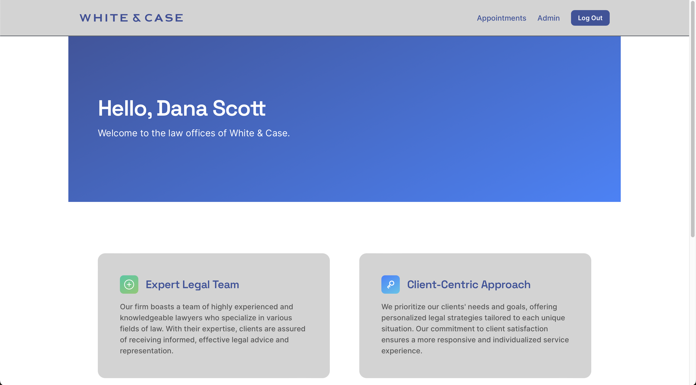
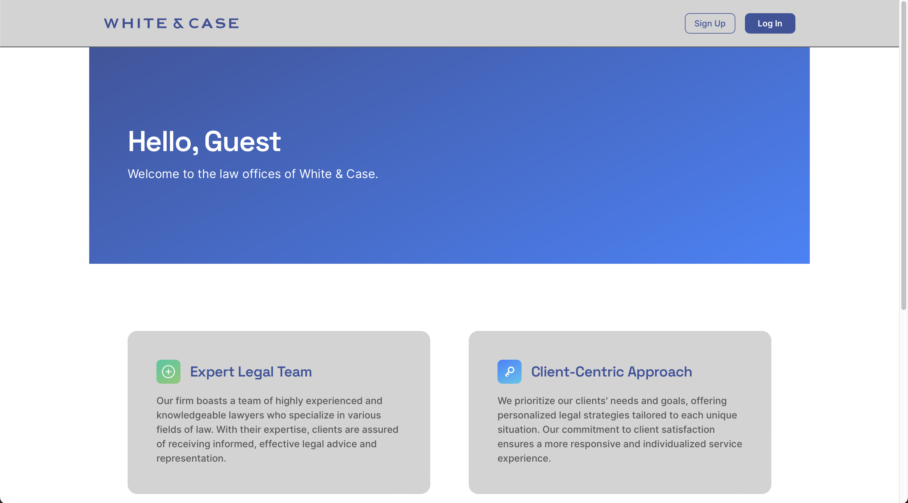
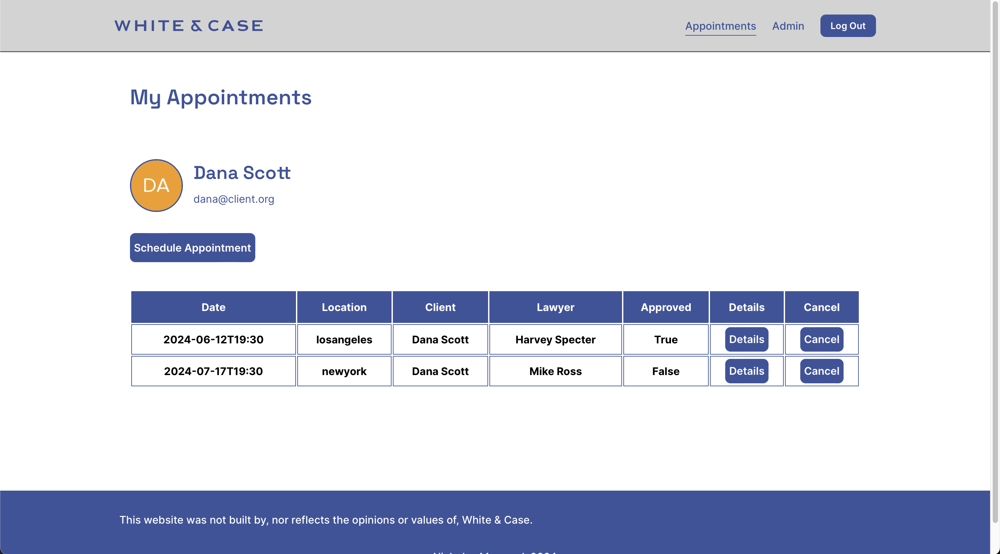
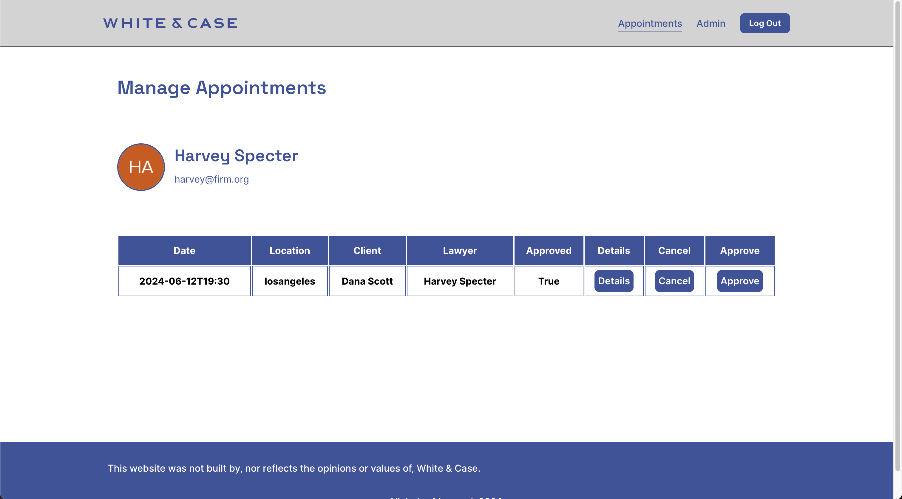
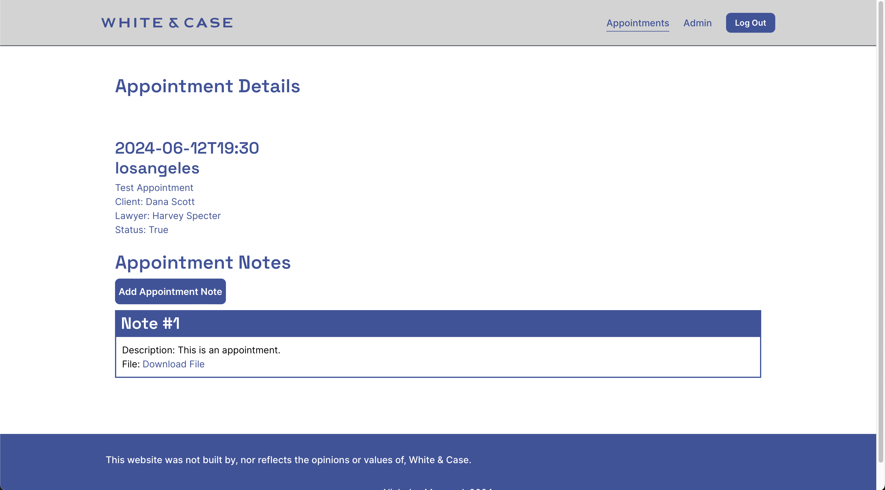
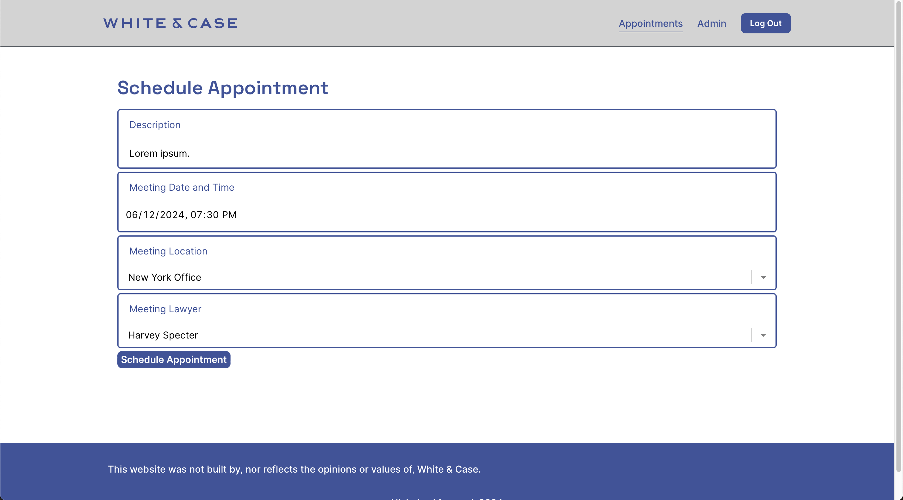
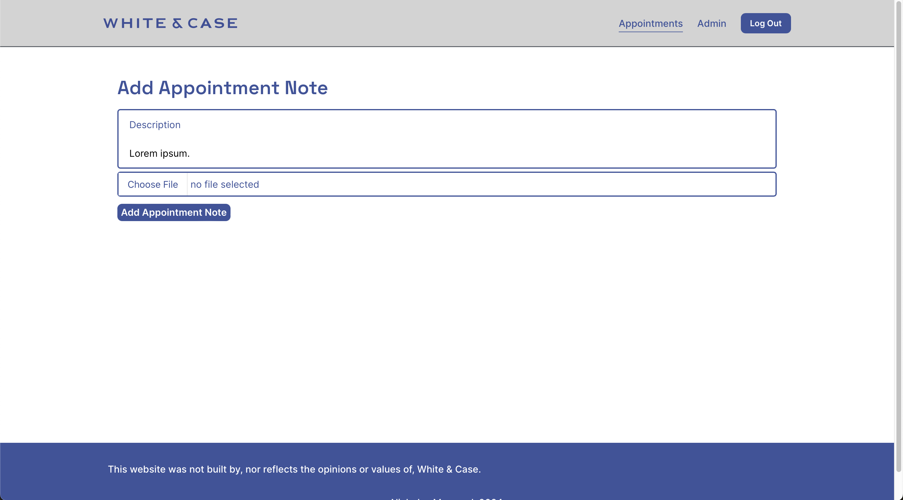
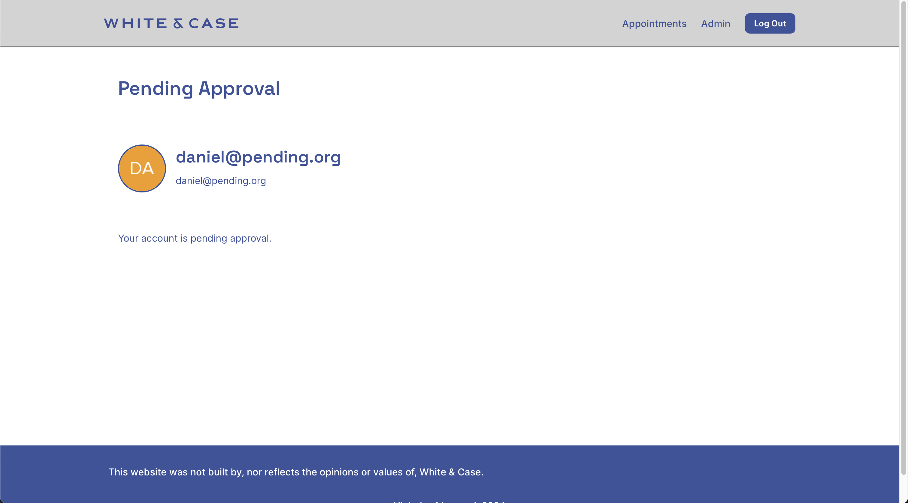
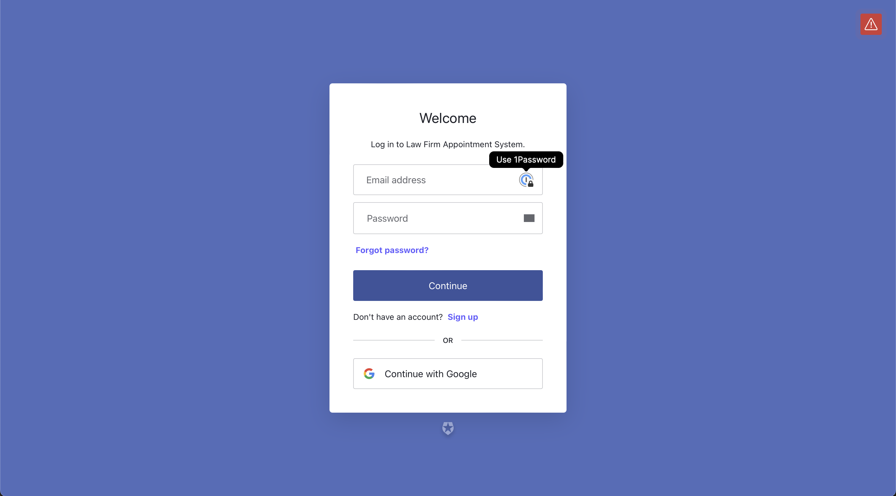

# Law Firm Appointment System Project
---
[Features](#features)
 
[Hosted Copy](#hosted)
 
[Setting Up Project](#project)
---
## Features

| Home Page (Signed In) | Home Page (Guest) |
| ----------- | ----------- |
|  |  |

| Appointments Page (Client) | Appointments Page (Lawyer) |
| ----------- | ----------- |
|  |  |

| Appointment Details | Appointment Scheduling |
| ----------- | ----------- |
|  |  |

| Appointment Note Creating | User Management |
| ----------- | ----------- |
|  |  |

| Pending Users Page | Auth0 Authentication |
| ----------- | ----------- |
|  |  |

## Hosted Copy

There is a hosted copy of this project at:
`http://35.245.161.91`  
The accounts set up for testing are:
- Lawyer: harvey@firm.org, Test123!
- Lawyer: mike@firm.org, Test123!
- Lawyer: louis@firm.org, Test123!
- Client: dana@client.org, Test123!
- Pending Account: daniel@pending.org, Test123!
